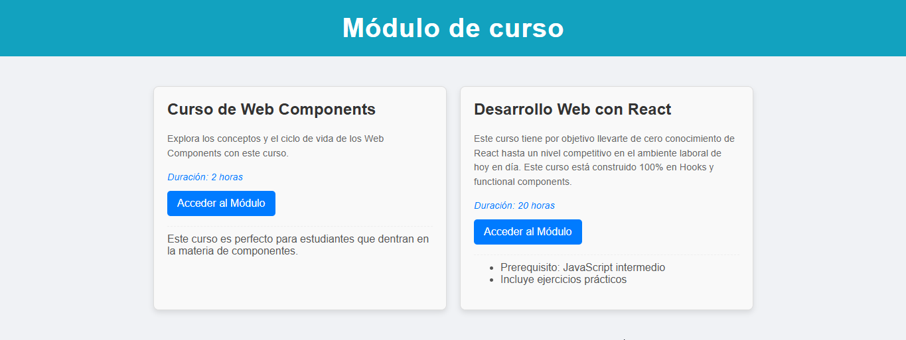
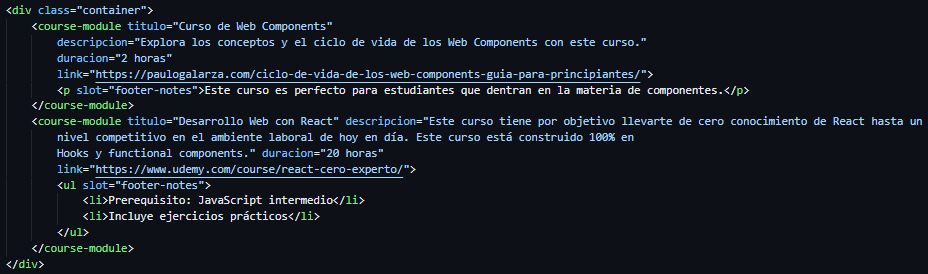

# web-component-darwin-doapanta# El tema que me tocó de Web Component es: Módulo de Curso (`<course-module>`)

Dentro de este repositorio encontramos un Web Component personalizado `<course-module>` diseñado para mostrar información sobre un módulo de curso, incluyendo su título, descripción, duración y un botón de acceso. Este componente es completamente funcional, semánticamente correcto y visualmente personalizable, demostrando la reutilización de código mediante atributos.

---

## 🚀 Funcionamiento del Componente

El `<course-module>` encapsula su estructura, estilos y lógica utilizando Shadow DOM, asegurando que sus elementos internos no colisionen con el resto de la página. Permite una fácil integración en cualquier proyecto web.

Al instanciar el componente en el HTML, se le pasan los datos a través de atributos HTML estándar. El componente se encarga de renderizar esta información y proporcionar un botón que dirige al usuario a un enlace especificado.

Se ha incluido un `slot` para permitir la inserción de contenido adicional y flexible al pie de cada módulo, como notas importantes, requisitos o recursos extra.

---

## 🎨 Atributos Personalizados

El componente `<course-module>` acepta los siguientes atributos para personalizar su contenido:

* **`titulo`** (obligatorio): El título del módulo del curso.
    * Ejemplo: `title="Introducción a Web Components"`
* **`descripcion`** (obligatorio): Una breve descripción del contenido del módulo.
    * Ejemplo: `description="Aprende los fundamentos para construir componentes web reutilizables."`
* **`duracion`** (obligatorio): La duración estimada del módulo.
    * Ejemplo: `duration="2 horas y 30 minutos"`
* **`link`** (obligatorio): La URL a la que el botón de acceso debe dirigir al usuario.
    * Ejemplo: `link="https://ejemplo.com/modulo"`

## 🧩 Uso del Slot

El componente expone un `slot` con el nombre `footer-notes`. Cualquier contenido HTML colocado dentro del componente y etiquetado con `slot="footer-notes"` será proyectado en la parte inferior del módulo.

* Ejemplo de uso de slot:
    ```html
    <course-module ...>
      <p slot="footer-notes">Este módulo es ideal para principiantes.</p>
    </course-module>
    ```

---

## 📸 Capturas de Pantalla del Componente en Uso


**Visualización de Componentes <course-module> en Navegador:**

**Código HTML donde instacio el componente <course-module> y uso de slots:**


---

## ⚙️ Código de Ejemplo para Reutilizar el Componente

Importamos el componente:

```html
<!DOCTYPE html>
<html lang="es">
<head>
    <meta charset="UTF-8">
    <meta name="viewport" content="width=device-width, initial-scale=1.0">
    <title>Uso de Course Module</title>
    <script type="module" src="course-module.js"></script>
    <style>
        /* damos un estilo general*/
        body { font-family: sans-serif; margin: 20px; }
        .container { display: flex; flex-wrap: wrap; gap: 20px; justify-content: center; }
    </style>
</head>
<body>
     <header>
        <h1>Módulo de curso </h1>
    </header>

    <div class="container">
        <!-- Y aqui usamos nuestro componente creado-->
        <course-module titulo="Curso de Web Components"
            descripcion="Explora los conceptos y el ciclo de vida de los Web Components con este curso."
            duracion="2 horas"
            link="https://paulogalarza.com/ciclo-de-vida-de-los-web-components-guia-para-principiantes/">
            <p slot="footer-notes">Este curso es perfecto para estudiantes que dentran en la materia de componentes.</p>
        </course-module>
        <course-module titulo="Desarrollo Web con React" descripcion="Este curso tiene por objetivo llevarte de cero conocimiento de React hasta un 
            nivel competitivo en el ambiente laboral de hoy en día. Este curso está construido 100% en 
            Hooks y functional components." duracion="20 horas"
            link="https://www.udemy.com/course/react-cero-experto/">
            <ul slot="footer-notes">
                <li>Prerequisito: JavaScript intermedio</li>
                <li>Incluye ejercicios prácticos</li>
            </ul>
        </course-module>
    </div>
</body>
</html>